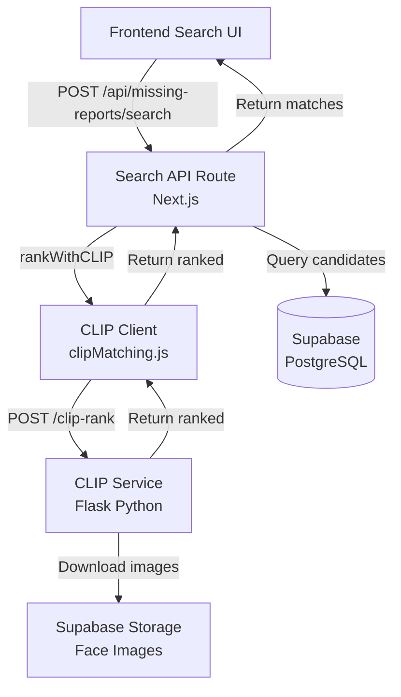
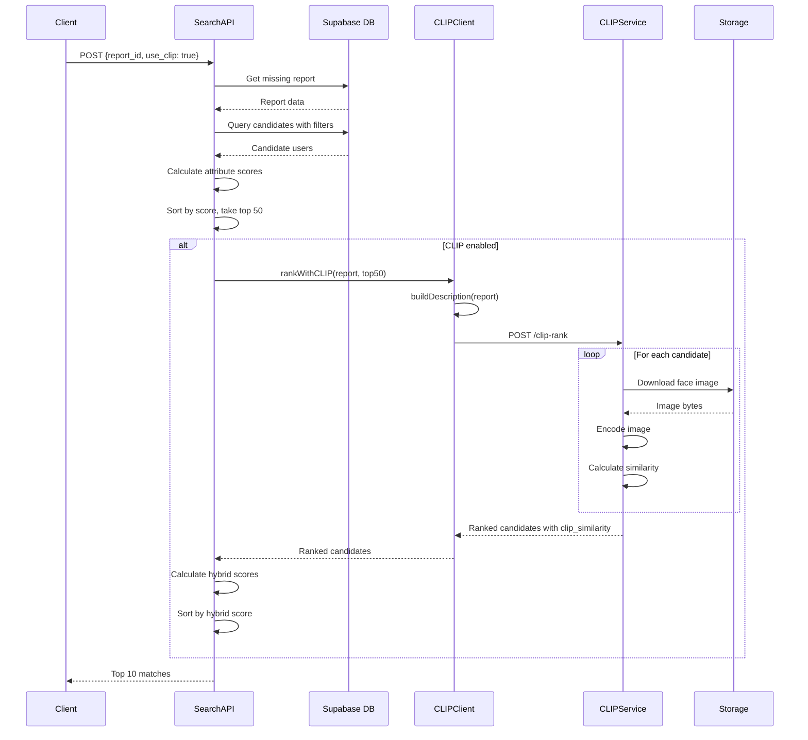
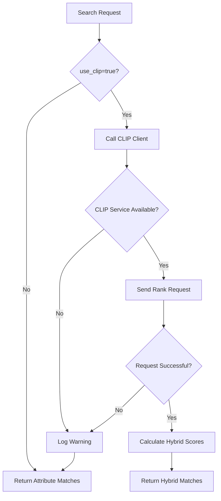

# Design Document: CLIP Semantic Search Integration

## Overview

This design integrates CLIP (Contrastive Language-Image Pre-training) semantic matching into the existing hybrid missing person search system. The system currently uses structured attribute matching to score candidates based on discrete fields like gender, height, and hair color. CLIP adds a second ranking stage that uses multimodal AI to match natural language descriptions against face images, significantly improving match quality when text descriptions are available.

### Problem Statement

The current attribute-based matching system has limitations:
- It only matches exact values (e.g., "tall" height must match exactly)
- It cannot understand nuanced descriptions like "scar on left cheek" or "wearing glasses"
- It cannot leverage the rich visual information in face images
- Match scores are based solely on counting matching attributes, which may not reflect true similarity

### Solution Approach

We implement a two-stage hybrid search:

1. **Stage 1 - Attribute Filtering**: Use structured SQL queries to filter candidates based on discrete attributes (gender, height, skin tone, etc.). This narrows the search space efficiently.

2. **Stage 2 - CLIP Ranking**: Convert the missing person report into a natural language description, then use CLIP to calculate semantic similarity between the description and candidate face images. This provides fine-grained ranking based on visual-semantic alignment.

The final ranking combines both attribute scores and CLIP similarity scores to leverage the strengths of both approaches.

### Key Design Decisions

1. **Pre-filter before CLIP**: Only pass top 50 attribute-matched candidates to CLIP to optimize performance
2. **Graceful degradation**: System falls back to attribute-only matching if CLIP service is unavailable
3. **Weighted hybrid scoring**: Combine attribute scores (40%) and CLIP similarity (60%) for final ranking
4. **Separate Python service**: CLIP runs in a dedicated Flask service to isolate ML dependencies from Next.js
5. **Timeout protection**: 30-second timeout on CLIP requests to prevent blocking the search API

## Architecture

### System Components



### Component Responsibilities

**Search API** (`rakshak/app/api/missing-reports/search/route.js`)
- Orchestrates the hybrid search workflow
- Fetches missing report details from database
- Queries candidate users with structured filters
- Calculates attribute-based match scores
- Calls CLIP Client for semantic ranking (when enabled)
- Combines attribute and CLIP scores into hybrid score
- Returns top 10 ranked matches

**CLIP Client** (`rakshak/lib/ai/clipMatching.js`)
- Builds natural language descriptions from structured attributes
- Calls CLIP Service via HTTP
- Handles errors and implements graceful degradation
- Provides health check functionality
- Implements 30-second timeout protection

**CLIP Service** (`face_recognition_module/clip_service.py`)
- Loads CLIP model on startup (openai/clip-vit-base-patch32)
- Encodes text descriptions into embeddings
- Downloads face images from Supabase Storage
- Encodes images into embeddings
- Calculates cosine similarity between text and image embeddings
- Returns candidates sorted by similarity

### Data Flow



### Deployment Architecture

The system requires two services running concurrently:

1. **Next.js Application** (Port 3000)
   - Serves the web UI
   - Hosts the Search API
   - Connects to Supabase

2. **CLIP Service** (Port 5001)
   - Python Flask application
   - Loads CLIP model into memory
   - Processes image ranking requests

Environment configuration:
- `FACE_SERVICE_URL`: URL of CLIP service (default: `http://localhost:5001`)
- `NEXT_PUBLIC_SUPABASE_URL`: Supabase project URL
- `SUPABASE_SERVICE_ROLE_KEY`: Admin key for database access

## Components and Interfaces

### Search API Interface

**Endpoint**: `POST /api/missing-reports/search`

**Request Body**:
```typescript
{
  report_id: string;      // UUID of missing report
  use_clip?: boolean;     // Enable CLIP ranking (default: false)
  limit?: number;         // Max candidates to consider (default: 50)
}
```

**Response**:
```typescript
{
  success: boolean;
  report: {
    id: string;
    name: string;
    age_range: string | null;
    gender: string;
  };
  matches: Array<{
    id: string;
    name: string;
    phone: string;
    gender: string;
    height: string;
    build: string;
    skin_tone: string;
    hair_color: string;
    hair_length: string;
    facial_hair: string;
    distinguishing_marks: string;
    selfie_url: string;
    match_score: number;           // Attribute score (0-100)
    clip_similarity?: number;      // CLIP score (0.0-1.0), if enabled
    matched_attributes: string[];
    match_confidence: number;      // 0.0-1.0
  }>;
  total_candidates: number;
  filters_applied: {
    age_range: boolean;
    gender: boolean;
    height: boolean;
    build: boolean;
    skin_tone: boolean;
    hair_color: boolean;
    hair_length: boolean;
    facial_hair: boolean;
  };
  clip_enabled?: boolean;
}
```

### CLIP Client Interface

**Function**: `buildDescription(report: Object): string`

Converts structured report fields into natural language description.

**Input**: Missing report object with fields:
- `age_min`, `age_max`, `age`
- `gender`
- `height`, `build`, `skin_tone`
- `hair_color`, `hair_length`, `facial_hair`
- `distinguishing_marks`, `accessories`, `clothing_description`, `identifying_details`

**Output**: Comma-separated natural language string
- Example: "age 25-35, male, tall height, athletic build, fair skin, short black hair, beard, scar on left cheek, wearing glasses"

**Function**: `rankWithCLIP(report: Object, candidates: Array): Promise<Array>`

Ranks candidates using CLIP semantic matching.

**Input**:
- `report`: Missing report object
- `candidates`: Array of candidate objects with `selfie_url` and other fields

**Output**: Promise resolving to candidates array sorted by `clip_similarity` descending

**Error Handling**: Returns original candidates unchanged if CLIP service fails

**Function**: `checkCLIPHealth(): Promise<boolean>`

Checks if CLIP service is operational.

**Output**: Promise resolving to `true` if service is healthy, `false` otherwise

**Timeout**: 2 seconds

### CLIP Service Interface

**Endpoint**: `POST /clip-rank`

**Request Body**:
```python
{
  "description": str,  # Natural language description
  "candidates": [
    {
      "id": str,
      "name": str,
      "image_url": str,  # URL to face image
      # ... other fields passed through
    }
  ]
}
```

**Response**:
```python
[
  {
    "id": str,
    "name": str,
    "clip_similarity": float,  # 0.0-1.0
    "clip_error": str,         # Optional, if image processing failed
    # ... all other fields from request
  }
]
```

**Endpoint**: `GET /health`

**Response**:
```python
{
  "status": "ok",
  "model": "openai/clip-vit-base-patch32"
}
```

## Data Models

### Missing Report

```typescript
interface MissingReport {
  id: string;
  name: string;
  age?: number;
  age_min?: number;
  age_max?: number;
  gender?: string;
  height?: 'short' | 'average' | 'tall';
  build?: 'slim' | 'average' | 'heavy' | 'athletic';
  skin_tone?: 'fair' | 'medium' | 'dark';
  hair_color?: string;
  hair_length?: 'bald' | 'short' | 'medium' | 'long';
  facial_hair?: 'clean_shaven' | 'beard' | 'mustache' | 'goatee' | 'stubble';
  distinguishing_marks?: string;
  clothing_description?: string;
  accessories?: string;
  identifying_details?: string;
  reported_by_user_id: string;
  created_at: string;
}
```

### User (Candidate)

```typescript
interface User {
  id: string;
  name: string;
  phone: string;
  gender?: string;
  height?: 'short' | 'average' | 'tall';
  build?: 'slim' | 'average' | 'heavy' | 'athletic';
  skin_tone?: 'fair' | 'medium' | 'dark';
  hair_color?: string;
  hair_length?: 'bald' | 'short' | 'medium' | 'long';
  facial_hair?: 'clean_shaven' | 'beard' | 'mustache' | 'goatee' | 'stubble';
  distinguishing_marks?: string;
  last_known_clothing?: string;
  accessories?: string;
  selfie_url?: string;
  face_encoding?: any;  // JSON array from face recognition
  assigned_camp_id?: string;
  created_at: string;
}
```

### Match Result

```typescript
interface MatchResult extends User {
  match_score: number;           // Attribute-based score (0-100)
  clip_similarity?: number;      // CLIP similarity (0.0-1.0)
  matched_attributes: string[];  // List of matching attribute names
  match_confidence: number;      // Normalized confidence (0.0-1.0)
}
```

### CLIP Request/Response

```typescript
interface CLIPRankRequest {
  description: string;
  candidates: Array<{
    id: string;
    name: string;
    image_url: string;
    [key: string]: any;  // Pass-through fields
  }>;
}

interface CLIPRankResponse extends Array<{
  id: string;
  name: string;
  clip_similarity: number;
  clip_error?: string;
  [key: string]: any;  // All original fields preserved
}> {}
```

## Algorithms

### Natural Language Description Builder

The `buildDescription()` function converts structured attributes into a natural language string that CLIP can understand.

**Algorithm**:
```
function buildDescription(report):
  parts = []
  
  // Age
  if report.age_min and report.age_max:
    parts.append("age {age_min}-{age_max}")
  else if report.age:
    parts.append("age {age}")
  
  // Gender
  if report.gender:
    parts.append(report.gender.toLowerCase())
  
  // Physical attributes
  if report.height:
    parts.append("{height} height")
  if report.build:
    parts.append("{build} build")
  if report.skin_tone:
    parts.append("{skin_tone} skin")
  
  // Hair
  if report.hair_color and report.hair_length:
    parts.append("{hair_length} {hair_color} hair")
  else if report.hair_color:
    parts.append("{hair_color} hair")
  else if report.hair_length:
    parts.append("{hair_length} hair")
  
  // Facial hair
  if report.facial_hair and report.facial_hair != 'clean_shaven':
    parts.append(report.facial_hair)
  
  // Distinguishing marks
  if report.distinguishing_marks:
    parts.append(report.distinguishing_marks)
  
  // Accessories
  if report.accessories:
    parts.append("wearing {accessories}")
  
  // Clothing
  if report.clothing_description:
    parts.append(report.clothing_description)
  
  // Other details
  if report.identifying_details:
    parts.append(report.identifying_details)
  
  return parts.join(", ")
```

**Example Output**:
- Input: `{age_min: 25, age_max: 35, gender: "Male", height: "tall", build: "athletic", skin_tone: "fair", hair_length: "short", hair_color: "black", facial_hair: "beard", distinguishing_marks: "scar on left cheek", accessories: "glasses"}`
- Output: `"age 25-35, male, tall height, athletic build, fair skin, short black hair, beard, scar on left cheek, wearing glasses"`

### Attribute Scoring Algorithm

The Search API calculates an attribute-based match score by comparing structured fields.

**Algorithm**:
```
function calculateAttributeScore(report, candidate):
  score = 0
  matched_attributes = []
  
  if report.gender == candidate.gender:
    score += 15
    matched_attributes.append('gender')
  
  if report.height == candidate.height:
    score += 8
    matched_attributes.append('height')
  
  if report.build == candidate.build:
    score += 8
    matched_attributes.append('build')
  
  if report.skin_tone == candidate.skin_tone:
    score += 10
    matched_attributes.append('skin_tone')
  
  if report.hair_color == candidate.hair_color:
    score += 10
    matched_attributes.append('hair_color')
  
  if report.hair_length == candidate.hair_length:
    score += 5
    matched_attributes.append('hair_length')
  
  if report.facial_hair == candidate.facial_hair:
    score += 7
    matched_attributes.append('facial_hair')
  
  // Fuzzy matching for distinguishing marks
  if report.distinguishing_marks and candidate.distinguishing_marks:
    keywords = report.distinguishing_marks.toLowerCase().split(/\s+/)
    candidate_marks = candidate.distinguishing_marks.toLowerCase()
    match_count = count(keyword in candidate_marks for keyword in keywords)
    if match_count > 0:
      score += match_count * 5
      matched_attributes.append('distinguishing_marks')
  
  return {
    score: score,
    matched_attributes: matched_attributes,
    confidence: min(score / 100, 1.0)
  }
```

**Score Weights**:
- Gender: 15 points (most discriminative)
- Skin tone: 10 points
- Hair color: 10 points
- Height: 8 points
- Build: 8 points
- Facial hair: 7 points
- Hair length: 5 points
- Distinguishing marks: 5 points per keyword match

**Maximum Score**: ~100 points (when all attributes match)

### CLIP Similarity Calculation

The CLIP Service calculates semantic similarity between text and images using cosine similarity of normalized embeddings.

**Algorithm**:
```
function calculateCLIPSimilarity(description, image_url):
  // Encode text
  text_inputs = processor.encode_text(description)
  text_features = model.get_text_features(text_inputs)
  text_features = normalize(text_features)  // L2 normalization
  
  // Download and encode image
  image = download_image(image_url)
  image_inputs = processor.encode_image(image)
  image_features = model.get_image_features(image_inputs)
  image_features = normalize(image_features)  // L2 normalization
  
  // Calculate cosine similarity
  similarity = dot_product(text_features, image_features)
  
  return similarity  // Range: -1.0 to 1.0, typically 0.0 to 1.0
```

**CLIP Model**: `openai/clip-vit-base-patch32`
- Vision Transformer with 32x32 patches
- Pre-trained on 400M image-text pairs
- Embedding dimension: 512
- Optimized for text-to-image matching

**Normalization**: Both text and image embeddings are L2-normalized to unit length, making cosine similarity equivalent to dot product.

**Similarity Range**: 0.0 (no similarity) to 1.0 (perfect match)

### Hybrid Score Combination

The final ranking combines attribute scores and CLIP similarity using a weighted formula.

**Algorithm**:
```
function calculateHybridScore(match_score, clip_similarity):
  // Normalize attribute score to 0-100 range (already in this range)
  attribute_component = match_score * 0.4
  
  // Scale CLIP similarity (0.0-1.0) to 0-60 range
  clip_component = clip_similarity * 60
  
  // Combine
  hybrid_score = attribute_component + clip_component
  
  return hybrid_score  // Range: 0-100
```

**Weight Rationale**:
- Attribute score: 40% weight (max 40 points)
- CLIP similarity: 60% weight (max 60 points)

CLIP receives higher weight because:
1. It captures nuanced visual details that attributes miss
2. It can match free-text descriptions like "scar on left cheek"
3. It provides fine-grained ranking among similar candidates
4. Attributes are already used for pre-filtering, so CLIP adds the most value in final ranking

**Example**:
- Candidate A: `match_score=70`, `clip_similarity=0.85`
  - Hybrid: `70 * 0.4 + 0.85 * 60 = 28 + 51 = 79`
- Candidate B: `match_score=80`, `clip_similarity=0.65`
  - Hybrid: `80 * 0.4 + 0.65 * 60 = 32 + 39 = 71`
- Result: Candidate A ranks higher despite lower attribute score

### Search Workflow Algorithm

The complete hybrid search workflow:

**Algorithm**:
```
function hybridSearch(report_id, use_clip, limit):
  // Step 1: Fetch report
  report = database.get_missing_report(report_id)
  
  // Step 2: Query candidates
  candidates = database.query_users(limit=limit)
  
  // Step 3: Calculate attribute scores
  scored_candidates = []
  for candidate in candidates:
    result = calculateAttributeScore(report, candidate)
    scored_candidates.append({
      ...candidate,
      match_score: result.score,
      matched_attributes: result.matched_attributes,
      match_confidence: result.confidence
    })
  
  // Step 4: Sort by attribute score
  scored_candidates.sort(by='match_score', descending=true)
  
  // Step 5: Take top 50 for CLIP ranking
  top_candidates = scored_candidates[0:50]
  
  // Step 6: CLIP ranking (if enabled)
  if use_clip and top_candidates.length > 0:
    try:
      ranked_candidates = rankWithCLIP(report, top_candidates)
      
      // Step 7: Calculate hybrid scores
      for candidate in ranked_candidates:
        if candidate.clip_similarity exists:
          candidate.hybrid_score = calculateHybridScore(
            candidate.match_score,
            candidate.clip_similarity
          )
        else:
          candidate.hybrid_score = candidate.match_score
      
      // Step 8: Sort by hybrid score
      ranked_candidates.sort(by='hybrid_score', descending=true)
      
      return ranked_candidates[0:10]
    
    catch error:
      // Graceful degradation: return attribute-only results
      log_error("CLIP ranking failed", error)
      return top_candidates[0:10]
  
  else:
    // Attribute-only mode
    return top_candidates[0:10]
```

**Performance Optimizations**:
1. Pre-filter to top 50 candidates before CLIP (reduces CLIP processing time)
2. CLIP processes images sequentially to avoid memory overflow
3. 30-second timeout on CLIP requests
4. 5-second timeout per image download
5. Graceful degradation if CLIP fails


## Correctness Properties

*A property is a characteristic or behavior that should hold true across all valid executions of a system—essentially, a formal statement about what the system should do. Properties serve as the bridge between human-readable specifications and machine-verifiable correctness guarantees.*

### Property Reflection

After analyzing all acceptance criteria, I identified several areas of redundancy:

1. **Description Builder field inclusion** (1.3, 1.5): These can be combined into a single property that verifies all fields are included when present
2. **Sorting properties** (2.6, 3.9, 5.3, 7.2): Multiple properties test sorting behavior - these can be consolidated by context
3. **Field preservation** (2.5, 5.4, 10.4): These test that data is passed through without loss - can be combined
4. **Embedding normalization** (3.2, 3.5): Both test the same normalization behavior for different input types

The following properties represent the unique, non-redundant correctness guarantees:

### Property 1: Description Builder Completeness

*For any* missing report with structured attributes, the generated description should contain all non-empty attribute values in natural language form.

**Validates: Requirements 1.1, 1.3, 1.5**

### Property 2: Age Range Formatting

*For any* missing report with both age_min and age_max values, the description should contain the substring "age {age_min}-{age_max}".

**Validates: Requirements 1.2**

### Property 3: Hair Attribute Formatting

*For any* missing report with both hair_length and hair_color values, the description should contain the substring "{hair_length} {hair_color} hair".

**Validates: Requirements 1.4**

### Property 4: Description Comma Separation

*For any* missing report with multiple attributes, the description should be a single string with parts separated by ", " (comma-space).

**Validates: Requirements 1.6**

### Property 5: Field Mapping Consistency

*For any* candidate with a selfie_url field, the CLIP request should map it to an image_url field while preserving all other candidate fields.

**Validates: Requirements 2.4, 2.5**

### Property 6: CLIP Response Sorting

*For any* set of candidates returned from CLIP service, they should be sorted by clip_similarity in descending order (highest first).

**Validates: Requirements 2.6, 3.9**

### Property 7: Embedding Normalization

*For any* text or image input to CLIP, the resulting embedding vector should have L2 norm equal to 1.0 (±0.001 tolerance).

**Validates: Requirements 3.2, 3.5**

### Property 8: Cosine Similarity Calculation

*For any* two normalized embedding vectors, the cosine similarity should equal their dot product and be in the range [0.0, 1.0].

**Validates: Requirements 3.6**

### Property 9: CLIP Similarity Field Presence

*For any* candidate processed by CLIP service, the response should include a clip_similarity field with a value between 0.0 and 1.0.

**Validates: Requirements 3.7**

### Property 10: Graceful Degradation

*For any* error during CLIP ranking, the CLIP client should return the original candidates unchanged (same order, same fields).

**Validates: Requirements 4.3**

### Property 11: Hybrid Score Formula

*For any* candidate with match_score and clip_similarity values, the hybrid_score should equal (match_score * 0.4) + (clip_similarity * 60).

**Validates: Requirements 5.1, 5.2**

### Property 12: Hybrid Score Sorting

*For any* set of candidates with hybrid scores, they should be sorted by hybrid_score in descending order (highest first).

**Validates: Requirements 5.3**

### Property 13: Response Field Preservation

*For any* candidate in the search results, the response should always include match_score, matched_attributes, and match_confidence fields.

**Validates: Requirements 5.4, 10.4**

### Property 14: Result Limit

*For any* search result set, the number of returned matches should be at most 10 (or the specified limit parameter).

**Validates: Requirements 5.5**

### Property 15: Attribute Score Sorting

*For any* set of candidates before CLIP ranking, they should be sorted by match_score (attribute score) in descending order.

**Validates: Requirements 7.2**

### Property 16: CLIP Candidate Limit

*For any* call to CLIP_Client.rankWithCLIP(), the number of candidates passed should be at most 50.

**Validates: Requirements 7.3**

## Error Handling

### Error Categories

1. **Network Errors**
   - CLIP service unreachable
   - Image download failures
   - Request timeouts

2. **Data Errors**
   - Missing required fields
   - Invalid image URLs
   - Malformed responses

3. **Service Errors**
   - CLIP service returns HTTP error
   - Model inference failures
   - Out of memory errors

### Error Handling Strategies

**CLIP Service Unreachable**:
```javascript
// In CLIP Client
try {
  const response = await fetch(`${CLIP_SERVICE_URL}/clip-rank`, {
    method: 'POST',
    headers: { 'Content-Type': 'application/json' },
    body: JSON.stringify({ description, candidates }),
    signal: AbortSignal.timeout(30000), // 30 second timeout
  });
  
  if (!response.ok) {
    throw new Error(`CLIP service returned ${response.status}`);
  }
  
  return await response.json();
  
} catch (error) {
  console.error('[CLIP] Ranking failed:', error.message);
  // Graceful degradation: return original candidates
  return candidates;
}
```

**Image Download Failures**:
```python
# In CLIP Service
for candidate in candidates:
    image_url = candidate.get('image_url')
    
    if not image_url:
        results.append({
            **candidate,
            'clip_similarity': 0.0
        })
        continue
    
    try:
        response = requests.get(image_url, timeout=5)
        response.raise_for_status()
        image = Image.open(BytesIO(response.content)).convert('RGB')
        
        # Process image...
        similarity = calculate_similarity(text_features, image)
        
        results.append({
            **candidate,
            'clip_similarity': similarity
        })
        
    except Exception as img_err:
        print(f"Error processing image {image_url}: {img_err}")
        results.append({
            **candidate,
            'clip_similarity': 0.0,
            'clip_error': str(img_err)
        })
```

**Missing Report Not Found**:
```javascript
// In Search API
const { data: report, error: reportError } = await supabase
  .from('missing_reports')
  .select('*')
  .eq('id', report_id)
  .single();

if (reportError || !report) {
  return NextResponse.json(
    { error: 'Report not found' },
    { status: 404 }
  );
}
```

**Empty Description**:
```javascript
// In CLIP Client
const description = buildDescription(report);

if (!description) {
  console.warn('[CLIP] No description could be built from report');
  return candidates; // Skip CLIP ranking
}
```

### Error Response Formats

**Search API Error Response**:
```json
{
  "error": "Report not found",
  "details": "No missing report with id abc-123"
}
```

**CLIP Service Error Response**:
```json
{
  "error": "description is required"
}
```

**Candidate with Image Error**:
```json
{
  "id": "user-123",
  "name": "John Doe",
  "clip_similarity": 0.0,
  "clip_error": "HTTPError: 404 Not Found"
}
```

### Logging Strategy

**CLIP Client Logging**:
```javascript
// Start of ranking
console.log(`[CLIP] Ranking ${candidates.length} candidates with description: "${description}"`);

// Success
console.log(`[CLIP] Ranked candidates. Top 3 similarities: ${
  rankedCandidates.slice(0, 3).map(c => c.clip_similarity.toFixed(3)).join(', ')
}`);

// Failure
console.error('[CLIP] Ranking failed:', error.message);
```

**CLIP Service Logging**:
```python
# Image processing error
print(f"Error processing image {image_url}: {img_err}")

# Request error
print(f"Error in clip_rank: {e}")
```

**Search API Logging**:
```javascript
// Query error
console.error('[MissingReports Search] Query error:', queryError);

// General error
console.error('[MissingReports Search] Error:', err);
```

### Timeout Configuration

| Component | Operation | Timeout | Rationale |
|-----------|-----------|---------|-----------|
| CLIP Client | HTTP request to CLIP service | 30 seconds | Allows processing ~50 images at 5s each |
| CLIP Service | Image download | 5 seconds | Prevents hanging on slow/dead URLs |
| CLIP Client | Health check | 2 seconds | Quick check, shouldn't block search |

### Graceful Degradation Flow



The system is designed to never fail completely - if CLIP is unavailable or errors occur, the search falls back to attribute-only matching, ensuring users can always search for missing persons.

## Testing Strategy

### Dual Testing Approach

This feature requires both unit tests and property-based tests to ensure comprehensive coverage:

**Unit Tests**: Verify specific examples, edge cases, error conditions, and integration points
- Specific example inputs with known outputs
- Edge cases (empty descriptions, missing fields, network errors)
- Error handling paths
- API contract validation
- Mock-based integration tests

**Property-Based Tests**: Verify universal properties across all inputs
- Universal properties that hold for all inputs
- Comprehensive input coverage through randomization
- Invariants that must always hold
- Round-trip properties
- Metamorphic properties

### Property-Based Testing Configuration

**Library Selection**:
- JavaScript/Node.js: `fast-check` (recommended for Next.js)
- Python: `hypothesis` (recommended for Flask)

**Test Configuration**:
- Minimum 100 iterations per property test (due to randomization)
- Each property test must reference its design document property
- Tag format: `Feature: clip-semantic-search-integration, Property {number}: {property_text}`

**Example Property Test Structure** (JavaScript with fast-check):
```javascript
import fc from 'fast-check';
import { buildDescription } from '@/lib/ai/clipMatching';

describe('Feature: clip-semantic-search-integration', () => {
  test('Property 1: Description Builder Completeness', () => {
    fc.assert(
      fc.property(
        fc.record({
          age_min: fc.option(fc.integer({ min: 0, max: 100 })),
          age_max: fc.option(fc.integer({ min: 0, max: 100 })),
          gender: fc.option(fc.constantFrom('Male', 'Female', 'Other')),
          height: fc.option(fc.constantFrom('short', 'average', 'tall')),
          build: fc.option(fc.constantFrom('slim', 'average', 'heavy', 'athletic')),
          skin_tone: fc.option(fc.constantFrom('fair', 'medium', 'dark')),
          hair_color: fc.option(fc.string()),
          hair_length: fc.option(fc.constantFrom('bald', 'short', 'medium', 'long')),
          // ... other fields
        }),
        (report) => {
          const description = buildDescription(report);
          
          // Verify all non-empty fields appear in description
          if (report.gender) {
            expect(description.toLowerCase()).toContain(report.gender.toLowerCase());
          }
          if (report.height) {
            expect(description).toContain(report.height);
          }
          // ... check other fields
        }
      ),
      { numRuns: 100 }
    );
  });
});
```

**Example Property Test Structure** (Python with hypothesis):
```python
from hypothesis import given, strategies as st
import numpy as np

@given(
    text_embedding=st.lists(st.floats(min_value=-1, max_value=1), min_size=512, max_size=512),
    image_embedding=st.lists(st.floats(min_value=-1, max_value=1), min_size=512, max_size=512)
)
def test_property_8_cosine_similarity_calculation(text_embedding, image_embedding):
    """
    Feature: clip-semantic-search-integration
    Property 8: Cosine Similarity Calculation
    
    For any two normalized embedding vectors, the cosine similarity should equal
    their dot product and be in the range [0.0, 1.0].
    """
    # Normalize embeddings
    text_norm = np.array(text_embedding) / np.linalg.norm(text_embedding)
    image_norm = np.array(image_embedding) / np.linalg.norm(image_embedding)
    
    # Calculate cosine similarity
    similarity = np.dot(text_norm, image_norm)
    
    # Verify properties
    assert 0.0 <= similarity <= 1.0, f"Similarity {similarity} out of range"
    
    # Verify it equals dot product for normalized vectors
    dot_product = np.dot(text_norm, image_norm)
    assert abs(similarity - dot_product) < 0.001
```

### Unit Test Coverage

**CLIP Client Tests** (`rakshak/lib/ai/clipMatching.test.js`):
- `buildDescription()` with various field combinations
- `buildDescription()` with empty report (edge case)
- `rankWithCLIP()` with successful response
- `rankWithCLIP()` with network error (graceful degradation)
- `rankWithCLIP()` with HTTP error response
- `rankWithCLIP()` with timeout
- `checkCLIPHealth()` when service is healthy
- `checkCLIPHealth()` when service is down
- Environment variable configuration

**CLIP Service Tests** (`face_recognition_module/test_clip_service.py`):
- `/clip-rank` endpoint with valid request
- `/clip-rank` endpoint with missing description
- `/clip-rank` endpoint with empty candidates
- `/clip-rank` endpoint with invalid image URLs
- `/clip-rank` endpoint with mixed valid/invalid images
- `/health` endpoint returns correct format
- Embedding normalization
- Cosine similarity calculation
- Error handling for image download failures

**Search API Tests** (`rakshak/app/api/missing-reports/search/route.test.js`):
- Search with valid report_id
- Search with invalid report_id (404 error)
- Search with use_clip=false (attribute-only)
- Search with use_clip=true (hybrid mode)
- Search with CLIP service unavailable (graceful degradation)
- Attribute score calculation
- Hybrid score calculation
- Result limiting (top 10)
- Response format validation

### Integration Tests

**End-to-End Hybrid Search**:
1. Create a missing report with structured attributes
2. Register users with matching and non-matching attributes
3. Call search API with use_clip=true
4. Verify CLIP service is called
5. Verify hybrid scores are calculated
6. Verify results are sorted correctly
7. Verify response format is correct

**CLIP Service Integration**:
1. Start CLIP service
2. Send rank request with real images
3. Verify embeddings are calculated
4. Verify similarities are in valid range
5. Verify results are sorted

**Graceful Degradation**:
1. Stop CLIP service
2. Call search API with use_clip=true
3. Verify search still returns results
4. Verify results are attribute-based only
5. Verify no clip_similarity fields in response

### Performance Tests

**CLIP Ranking Performance**:
- Measure time to rank 50 candidates
- Verify total time < 30 seconds
- Measure time per image download
- Verify image download timeout works

**Search API Performance**:
- Measure time for attribute-only search
- Measure time for hybrid search
- Compare performance with/without CLIP
- Verify database query performance

### Test Data Generators

**Missing Report Generator**:
```javascript
function generateMissingReport() {
  return {
    id: faker.string.uuid(),
    name: faker.person.fullName(),
    age_min: faker.number.int({ min: 18, max: 60 }),
    age_max: faker.number.int({ min: 18, max: 60 }),
    gender: faker.helpers.arrayElement(['Male', 'Female', 'Other']),
    height: faker.helpers.arrayElement(['short', 'average', 'tall']),
    build: faker.helpers.arrayElement(['slim', 'average', 'heavy', 'athletic']),
    skin_tone: faker.helpers.arrayElement(['fair', 'medium', 'dark']),
    hair_color: faker.color.human(),
    hair_length: faker.helpers.arrayElement(['bald', 'short', 'medium', 'long']),
    facial_hair: faker.helpers.arrayElement(['clean_shaven', 'beard', 'mustache', 'goatee']),
    distinguishing_marks: faker.lorem.sentence(),
    accessories: faker.helpers.arrayElement(['glasses', 'watch', 'jewelry']),
  };
}
```

**Candidate Generator**:
```javascript
function generateCandidate() {
  return {
    id: faker.string.uuid(),
    name: faker.person.fullName(),
    phone: faker.phone.number(),
    gender: faker.helpers.arrayElement(['Male', 'Female', 'Other']),
    height: faker.helpers.arrayElement(['short', 'average', 'tall']),
    build: faker.helpers.arrayElement(['slim', 'average', 'heavy', 'athletic']),
    skin_tone: faker.helpers.arrayElement(['fair', 'medium', 'dark']),
    selfie_url: faker.image.avatar(),
    match_score: faker.number.int({ min: 0, max: 100 }),
    matched_attributes: [],
    match_confidence: faker.number.float({ min: 0, max: 1 }),
  };
}
```

### Test Execution

**Run Unit Tests**:
```bash
# JavaScript tests
npm test

# Python tests
pytest face_recognition_module/test_clip_service.py
```

**Run Property-Based Tests**:
```bash
# JavaScript property tests
npm test -- --testPathPattern=property

# Python property tests
pytest face_recognition_module/test_clip_properties.py
```

**Run Integration Tests**:
```bash
# Start services
npm run dev &
python face_recognition_module/clip_service.py &

# Run integration tests
npm test -- --testPathPattern=integration
```

### Test Coverage Goals

- Unit test coverage: >80% for all components
- Property test coverage: All 16 correctness properties implemented
- Integration test coverage: All critical user flows
- Error path coverage: All error handling paths tested

### Continuous Integration

Tests should run automatically on:
- Every commit (unit tests)
- Every pull request (unit + property tests)
- Before deployment (full test suite including integration)

The property-based tests provide high confidence that the system behaves correctly across a wide range of inputs, while unit tests ensure specific edge cases and error conditions are handled properly.
